# List of Songs

<table>
    <thead>
      <tr>
        <th rowspan="2" style="width:90px;">Thumbnail</th>
        <th rowspan="2">Song</th>
        <th rowspan="2">Personal song for character</th>
        <th rowspan="2">Image</th>
        <th colspan="4">Effects</th>
        <th rowspan="2">BPM</th>
        <th rowspan="2">Appeal count</th>
        <th rowspan="2">Timing of final appeal</th>
        <th rowspan="2">Quintet</th>
      </tr>
      <tr>
        <th class="da">DA.</th>
        <th class="vi">VI.</th>
        <th class="vo">VO.</th>
        <th>Total</th>
      </tr>
    </thead>
  <tbody>
    <tr>
      <td></td>
      <td markdown="span">[GO MY WAY!!](go-my-way)</td>
      <td>Haruka</td>
      <td class="da">DA.</td>
      <td class="da">8</td>
      <td class="vi">0</td>
      <td class="vo">2</td>
      <td>10</td>
      <td>180</td>
      <td>136</td>
      <td>
        (Right before the end of the instrumental) "dada!! (END) dada!!dadadada!! GO MY WAY~" 
        <audio controls src="/assets/audio/go-my-way-end.mp3"></audio>
      </td>
      <td>✗</td>
    </tr>
    <tr>
      <td></td>
      <td markdown="span">[Relations](relations)</td>
      <td>Miki</td>
      <td class="da">DA.</td>
      <td class="da">8</td>
      <td class="vi">5</td>
      <td class="vo">5</td>
      <td>18</td>
      <td>142</td>
      <td>120</td>
      <td>
        kowareru kurai ni dakishimete (END) 
        <audio controls src="/assets/audio/relations-end.mp3"></audio>
      </td>
      <td>✗</td>
    </tr>
    <tr>
      <td>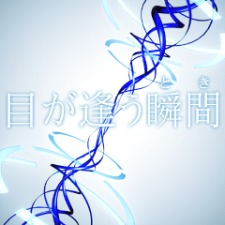</td>
      <td markdown="span">[Me ga Au Toki](me-ga-au-toki)</td>
      <td>Chihaya</td>
      <td class="vi">VI.</td>
      <td class="da">4</td>
      <td class="vi">8</td>
      <td class="vo">6</td>
      <td>18</td>
      <td>145</td>
      <td>120</td>
      <td>
        (instrumental) / me to me ga au shunkan suki da to kizuita (END) / anata wa 
        <audio controls src="/assets/audio/me-ga-au-toki-end.mp3"></audio>
      </td>
      <td>✗</td>
    </tr>
    <tr>
      <td>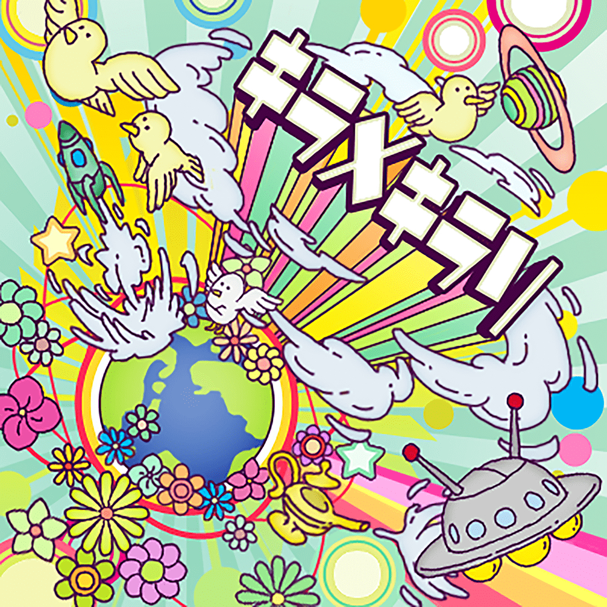</td>
      <td markdown="span">[Kiramekirari](kiramekirari)</td>
      <td>Yayoi</td>
      <td class="da">DA.</td>
      <td class="da">8</td>
      <td class="vi">2</td>
      <td class="vo">0</td>
      <td>10</td>
      <td>180</td>
      <td>150</td>
      <td>
        genki ni hajimereba ALL OK / toki(END)mekirari 
        <audio controls src="/assets/audio/kiramekirari-end.mp3"></audio>
      </td>
      <td>✗</td>
    </tr>
    <tr>
      <td></td>
      <td markdown="span">[Kosmos, Cosmos](kosmos-cosmos)</td>
      <td>Yukiho</td>
      <td class="da">DA.</td>
      <td class="da">8</td>
      <td class="vi">7</td>
      <td class="vo">7</td>
      <td>22</td>
      <td>132</td>
      <td>103</td>
      <td>
        supiido wo fumikonde / hirari (END) furari 
        <audio controls src="/assets/audio/kosmos-cosmos-end.mp3"></audio>
      </td>
      <td>✗</td>
    </tr>
    <tr>
     <td>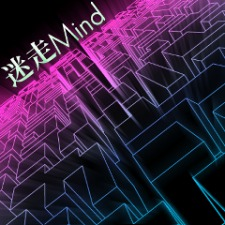</td>
      <td markdown="span">[Meisou Mind](meisou-mind)</td>
      <td>Makoto</td>
      <td class="vo">VO.</td>
      <td class="da">6</td>
      <td class="vi">2</td>
      <td class="vo">8</td>
      <td>16</td>
      <td>152</td>
      <td>120</td>
      <td>
        totsuzen no kurayami to (END) 
        <audio controls src="/assets/audio/meisou-mind-end.mp3"></audio>
      </td>
      <td>✗</td>
    </tr>
    <tr>
     <td></td>
      <td markdown="span">[Do-Dai](do-dai)</td>
      <td>Mami</td>
      <td class="da">DA.</td>
      <td class="da">8</td>
      <td class="vi">4</td>
      <td class="vo">0</td>
      <td>12</td>
      <td>171</td>
      <td>150</td>
      <td>
        herohero prinsesu genbatouchaku (END) / purinsu mirunari 
        <audio controls src="/assets/audio/do-dai-end.mp3"></audio>
      </td>
      <td>✗</td>
    </tr>
    <tr>
     <td></td>
      <td markdown="span">[My Best Friend](my-best-friend)</td>
      <td>Takane</td>
      <td class="vi">VI.</td>
      <td class="da">4</td>
      <td class="vi">8</td>
      <td class="vo">6</td>
      <td>18</td>
      <td>157</td>
      <td>120</td>
      <td>
        maru de jetto koosutaa mitai ne / (END) itsudemo dokidoki 
        <audio controls src="/assets/audio/my-best-friend-end.mp3"></audio>
      </td>
      <td>✗</td>
    </tr>
    <tr>
      <td></td>
      <td markdown="span">[Shiny Smile](shiny-smile)</td>
      <td>Hibiki</td>
      <td class="vi">VI.</td>
      <td class="da">4</td>
      <td class="vi">8</td>
      <td class="vo">0</td>
      <td>12</td>
      <td>170</td>
      <td>150</td>
      <td>
        ishikoro wo kawashite / nakisou na (END) omoi wo 
        <audio controls src="/assets/audio/shiny-smile-end.mp3"></audio>
      </td>
      <td>✗</td>
    </tr>
    <tr>
     <td>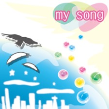</td>
      <td markdown="span">[My Song](my-song)</td>
      <td>Ryuugu Komachi</td>
      <td class="vo">VO.</td>
      <td class="da">7</td>
      <td class="vi">7</td>
      <td class="vo">8</td>
      <td>22</td>
      <td>104</td>
      <td>88</td>
      <td>
        itsuka wa omoide ni naru (END) kara 
        <audio controls src="/assets/audio/my-song-end.mp3"></audio>
      </td>
      <td>✗</td>
    </tr>
    <tr>
     <td></td>
      <td markdown="span">[I](i)</td>
      <td>Ryuugu Komachi</td>
      <td class="vo">VO.</td>
      <td class="da">5</td>
      <td class="vi">5</td>
      <td class="vo">8</td>
      <td>18</td>
      <td>140</td>
      <td>120</td>
      <td>
        uta ya dansu de jibun wo tsutaeyo(END)u 
        <audio controls src="/assets/audio/i-end.mp3"></audio>
      </td>
      <td>✗</td>
    </tr>
    <tr>
      <td></td>
      <td markdown="span">[Little Match Girl](little-match-girl)</td>
      <td>-</td>
      <td class="vi">VI.</td>
      <td class="da">7</td>
      <td class="vi">8</td>
      <td class="vo">7</td>
      <td>22</td>
      <td>135</td>
      <td>103</td>
      <td>
        kareteku kodou, kikitaku nai yo  (END) 
        <audio controls src="/assets/audio/little-match-girl-end.mp3"></audio>
      </td>
      <td>✗</td>
    </tr>
    <tr>
      <td></td>
      <td markdown="span">[Ai LIKE Hamburger](ai-like-hamburger)</td>
      <td>-</td>
      <td class="vi">VI.</td>
      <td class="da">2</td>
      <td class="vi">8</td>
      <td class="vo">0</td>
      <td>10</td>
      <td>192</td>
      <td>150</td>
      <td>
        daisuki suki yo hanbaagaa / daisuki yo (END) hanbaagaa 
        <audio src="/assets/audio/ai-like-hamburger-end.mp3" controls></audio>
      </td>
      <td>✗</td>
    </tr>
    <tr>
      <td>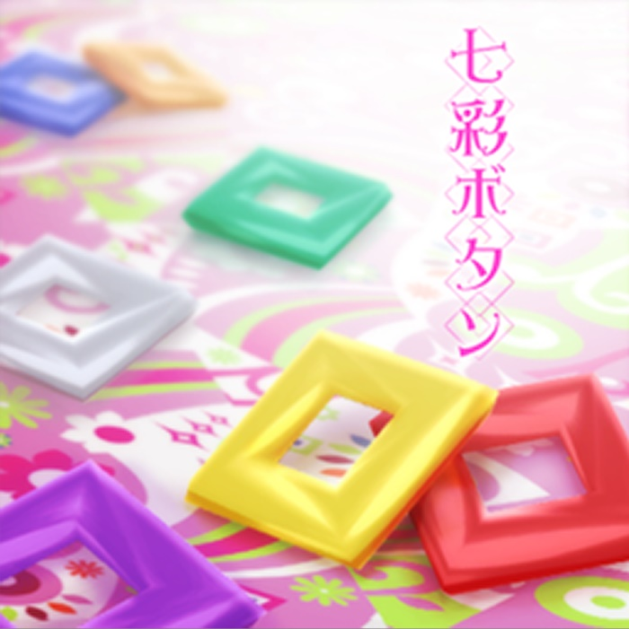</td>
      <td markdown="span">[Nanairo Button](nanairo-button)</td>
      <td>-</td>
      <td class="vi">VI.</td>
      <td class="da">7</td>
      <td class="vi">8</td>
      <td class="vo">7</td>
      <td>22</td>
      <td>128</td>
      <td>103</td>
      <td>
        Kimi ga fureta kara nanairo botan / subete wo niji ni (END) kaeta yo 
        <audio src="/assets/audio/nanairo-button-end.mp3" controls></audio>
      </td>
      <td>✗</td>
    </tr>
    <tr>
      <td></td>
      <td markdown="span">[SMOKY THRILL](smoky-thrill)</td>
      <td>-</td>
      <td class="vo">VO.</td>
      <td class="da">6</td>
      <td class="vi">4</td>
      <td class="vo">8</td>
      <td>18</td>
      <td>146</td>
      <td>120</td>
      <td>
        oh, saraba! / a(END)wayokuba 
        <audio src="/assets/audio/smoky-thrill-end.mp3" controls></audio>
      </td>
      <td>✓</td>
    </tr>
    <tr>
      <td>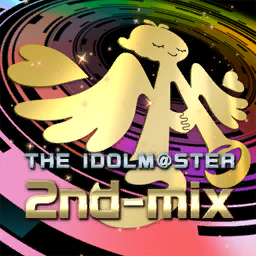</td>
      <td markdown="span">[THE IDOLM@STER 2nd-mix](the-idolmaster-2nd-mix)</td>
      <td>-</td>
      <td class="da">DA.</td>
      <td class="da">8</td>
      <td class="vi">4</td>
      <td class="vo">2</td>
      <td>14</td>
      <td>168</td>
      <td>136</td>
      <td>
        (instrumental) / atara(END)shii 
        <audio controls src="/assets/audio/the-idolmaster-2nd-mix-end.mp3"></audio>
      </td>
      <td>✓</td>
    </tr>
    <tr>
      <td>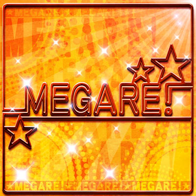</td>
      <td markdown="span">[MEGARE!](megare)</td>
      <td>-</td>
      <td class="vi">VI.</td>
      <td class="da">0</td>
      <td class="vi">8</td>
      <td class="vo">2</td>
      <td>10</td>
      <td>180</td>
      <td>150</td>
      <td>
        kandousaserareru ka na / (END) mezase aidoru 
        <audio controls src="/assets/audio/megare-end.mp3"></audio>
      </td>
      <td>✓</td>
    </tr>
    <tr>]
      <td></td>
      <td markdown="span">[The world is all one !!](the-world-is-all-one)</td>
      <td>-</td>
      <td class="vo">VO.</td>
      <td class="da">4</td>
      <td class="vi">2</td>
      <td class="vo">8</td>
      <td>14</td>
      <td>167</td>
      <td>150</td>
      <td>
        sekaijuu no te wo tori (END) 
        <audio controls src="/assets/audio/the-world-is-all-one-end.mp3"></audio>
      </td>
      <td>✓</td>
    </tr>
    <tr>
      <td></td>
      <td markdown="span">[Honey Heartbeat](honey-heartbeat)</td>
      <td>-</td>
      <td class="da">DA.</td>
      <td class="da">8</td>
      <td class="vi">5</td>
      <td class="vo">5</td>
      <td>18</td>
      <td>142</td>
      <td>120</td>
      <td>
        Say. my honey. What you wan(END)t. senaka ni 
        <audio controls src="/assets/audio/honey-heartbeat-end.mp3"></audio>
      </td>
      <td>✓</td>
    </tr>
    <tr>
      <td></td>
      <td markdown="span">[READY!!](ready)</td>
      <td>-</td>
      <td class="vo">VO.</td>
      <td class="da">2</td>
      <td class="vi">0</td>
      <td class="vo">8</td>
      <td>10</td>
      <td>174</td>
      <td>150</td>
      <td>
        deai ya wakare wa ai ni naru AMUSEMENT / ALREADY!! WE(END)'RE ALL 
        <audio controls src="/assets/audio/ready-end.mp3"></audio>
      </td>
      <td>✓</td>
    </tr>
  </tbody>
</table>

## DLC Songs

<table>
  <thead>
    <tr>
      <th rowspan="2" style="width:90px;">Thumbnail</th>
      <th rowspan="2">Song</th>
      <th rowspan="2">Catalog vol.</th>
      <th rowspan="2">Personal song for character</th>
      <th rowspan="2">Image</th>
      <th colspan="4">Effects</th>
      <th rowspan="2">BPM</th>
      <th rowspan="2">Appeal count</th>
      <th rowspan="2">Timing of final appeal</th>
      <th rowspan="2">Quintet</th>
    </tr>
    <tr>
      <th class="da">DA.</th>
      <th class="vi">VI.</th>
      <th class="vo">VO.</th>
      <th>Total</th>
    </tr>
  </thead>
  <tbody>
    <tr>
      <td></td>
      <td markdown="span">[Kami SUMMER!!](kami-summer)</td>
      <td>Vol. 01</td>
      <td>-</td>
      <td class="da">DA.</td>
      <td class="da">8</td>
      <td class="vi">4</td>
      <td class="vo">2</td>
      <td>14</td>
      <td>160</td>
      <td>136</td>
      <td>(during instrumental: separating hands and then waving in front of face (END) then spreading apart again)</td>
      <td>✗</td>
    </tr>
    <tr>
      <td></td>
      <td markdown="span">[Jibun REST@RT](jibun-restart)</td>
      <td>Vol. 02</td>
      <td>-</td>
      <td class="vi">VI.</td>
      <td class="da">2</td>
      <td class="vi">8</td>
      <td class="vo">0</td>
      <td>10</td>
      <td>171</td>
      <td>150</td>
      <td>
        donna ni tookutemo ikou / akogare no (END) sekai 
        <audio controls src="/assets/audio/jibun-restart-end.mp3"></audio>
      </td>
      <td>✓</td>
    </tr>
    <tr>
      <td></td>
      <td markdown="span">[Kami-sama no Birthday](kami-sama-no-birthday)</td>
      <td>Vol. 02</td>
      <td>-</td>
      <td class="vo">VO.</td>
      <td class="da">5</td>
      <td class="vi">5</td>
      <td class="vo">8</td>
      <td>18</td>
      <td>148</td>
      <td>120</td>
      <td>shiroi enogu zenbu tsukatte (END) nurikaeru ashita mo</td>
      <td>✗</td>
    </tr>
    <tr>
      <td>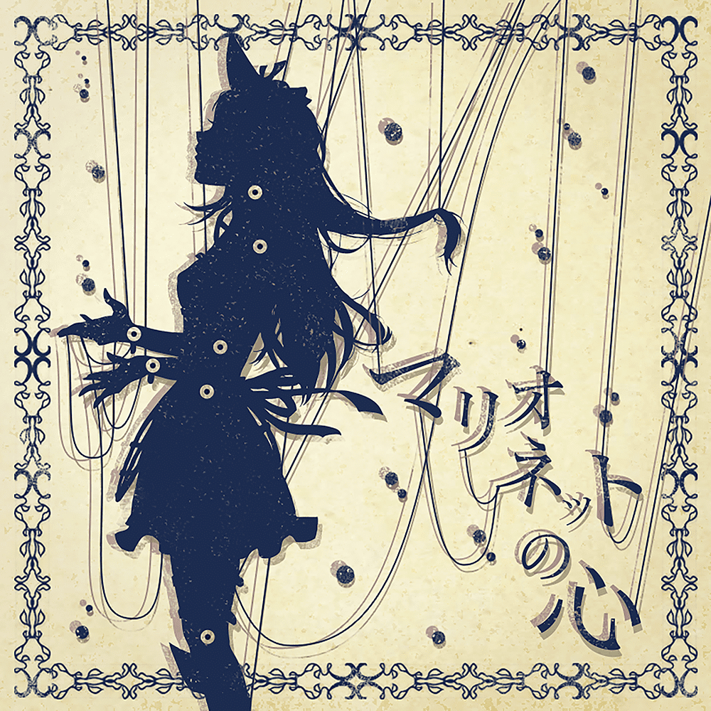</td>
      <td markdown="span">[Marionette no Kokoro](marionette-no-kokoro)</td>
      <td>Vol. 03</td>
      <td>Miki</td>
      <td class="da">DA.</td>
      <td class="da">8</td>
      <td class="vi">2</td>
      <td class="vo">4</td>
      <td>14</td>
      <td>152</td>
      <td>136</td>
      <td>anata ni kimochi todokanai Ah modokashii (END) / hora ne</td>
      <td>✗</td>
    </tr>
    <tr>
      <td></td>
      <td markdown="span">[CHANGE!!!!](change)</td>
      <td>Vol. 04</td>
      <td>-</td>
      <td class="da">DA.</td>
      <td class="da">8</td>
      <td class="vi">0</td>
      <td class="vo">2</td>
      <td>10</td>
      <td>170</td>
      <td>150</td>
      <td>arashii kyou (END) habatakinagara</td>
      <td>✓</td>
    </tr>
    <tr>
      <td></td>
      <td markdown="span">[Brand New Day!](brand-new-day)</td>
      <td>Vol. 05</td>
      <td>-</td>
      <td class="vo">VO.</td>
      <td class="da">2</td>
      <td class="vi">0</td>
      <td class="vo">8</td>
      <td>10</td>
      <td>163</td>
      <td>150</td>
      <td>maketari hekondari shina(END)i</td>
      <td>✗</td>
    </tr>
    <tr>
      <td>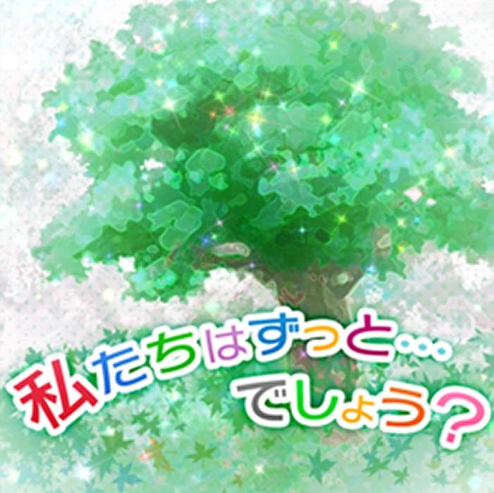</td>
      <td markdown="span">[Watashi-tachi wa Zutto... Deshō?](watashi-tachi-wa-zutto-desho)</td>
      <td>Vol. 06</td>
      <td>-</td>
      <td class="vi">VI.</td>
      <td class="da">5</td>
      <td class="vi">8</td>
      <td class="vo">5</td>
      <td>18</td>
      <td>142</td>
      <td>120</td>
      <td>futoshita guuzen deshō? kono (END) akogare wa motto</td>
      <td>✓</td>
    </tr>
    <tr>
      <td></td>
      <td markdown="span">[Kyun! Vampire Girl](kyun-vampire-girl)</td>
      <td>Vol. 07</td>
      <td>-</td>
      <td class="vo">VO.</td>
      <td class="da">5</td>
      <td class="vi">5</td>
      <td class="vo">8</td>
      <td>18</td>
      <td>145</td>
      <td>120</td>
      <td>(from instrumental) shanari sha(END)nari</td>
      <td>✗</td>
    </tr>
    <tr>
      <td></td>
      <td markdown="span">[Overmaster](overmaster)</td>
      <td>Vol. 08</td>
      <td>-</td>
      <td class="da">DA.</td>
      <td class="da">8</td>
      <td class="vi">4</td>
      <td class="vo">0</td>
      <td>12</td>
      <td>178</td>
      <td>150</td>
      <td>wild yori dan(END)gerous</td>
      <td>✓</td>
    </tr>
    <tr>
      <td></td>
      <td markdown="span">[L.O.B.M](lobm)</td>
      <td>Vol. 09</td>
      <td>-</td>
      <td class="vi">VI.</td>
      <td class="da">2</td>
      <td class="vi">8</td>
      <td class="vo">4</td>
      <td>14</td>
      <td>170</td>
      <td>136</td>
      <td>massugu mae ni mu(END)katte</td>
      <td>✓</td>
    </tr>
    <tr>
      <td>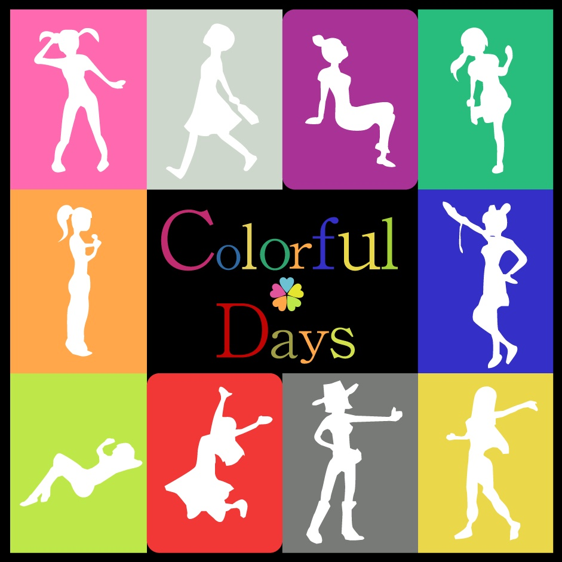</td>
      <td markdown="span">[Colorful Days](colorful-days)</td>
      <td>Vol. 10</td>
      <td>-</td>
      <td class="vi">VI.</td>
      <td class="da">5</td>
      <td class="vi">8</td>
      <td class="vo">5</td>
      <td>18</td>
      <td>159</td>
      <td>120</td>
      <td>kirei da ne / fre(END)sh</td>
      <td>✗</td>
    </tr>
    <tr>
      <td></td>
      <td markdown="span">[I Want](i-want)</td>
      <td>Vol. 11</td>
      <td>Haruka</td>
      <td class="vo">VO.</td>
      <td class="da">4</td>
      <td class="vi">0</td>
      <td class="vo">8</td>
      <td>12</td>
      <td>178</td>
      <td>150</td>
      <td>soko ni hizamazuite (END) mitome</td>
      <td>✗</td>
    </tr>
    <tr>
      <td>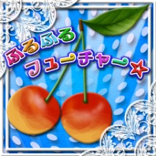</td>
      <td markdown="span">[Furu-Furu Future☆](furu-furu-future)</td>
      <td>Vol. 12</td>
      <td>Miki</td>
      <td class="vi">VI.</td>
      <td class="da">7</td>
      <td class="vi">8</td>
      <td class="vo">7</td>
      <td>22</td>
      <td>127</td>
      <td>103</td>
      <td>kimagure nano zutto mitete zet(END)tai yo</td>
      <td>✗</td>
    </tr>
    <tr>
      <td>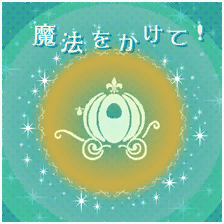</td>
      <td markdown="span">[Mahou o Kakete!](mahou-o-kakete)</td>
      <td>Vol. 13</td>
      <td>Ritsuko</td>
      <td class="vo">VO.</td>
      <td class="da"></td>
      <td class="vi"></td>
      <td class="vo"></td>
      <td></td>
      <td>150</td>
      <td></td>
      <td>sora o kakeru mahou no basha youi (END) shiteru wa</td>
      <td>✗</td>
    </tr>
    <tr>
      <td>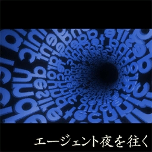</td>
      <td markdown="span">[Agent Yoru o Yuku](agent-yoru-o-yuku)</td>
      <td>Vol. 14</td>
      <td>Makoto</td>
      <td>DA.</td>
      <td class="da"></td>
      <td class="vi"></td>
      <td class="vo"></td>
      <td></td>
      <td>178</td>
      <td></td>
      <td></td>
      <td>✗</td>
    </tr>
    <tr>
      <td>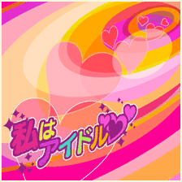</td>
      <td markdown="span">[Watashi wa Idol♡](watashi-wa-idol)</td>
      <td>Vol. 15</td>
      <td>Haruka, Iori</td>
      <td>VI.</td>
      <td class="da"></td>
      <td class="vi"></td>
      <td class="vo"></td>
      <td></td>
      <td>168</td>
      <td></td>
      <td></td>
      <td>✗</td>
      
  </tr>
  <tr>
      <td>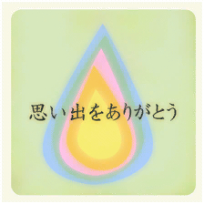</td>
      <td markdown="span">[Omoide wo Arigatou](omoide-wo-arigatou)</td>
      <td>Vol. 16</td>
      <td>Chihaya, Miki</td>
      <td>VO.</td>
      <td class="da"></td>
      <td class="vi"></td>
      <td class="vo"></td>
      <td></td>
      <td>133</td>
      <td></td>
      <td></td>
      <td>✗</td>
  </tr>
  <tr>
      <td>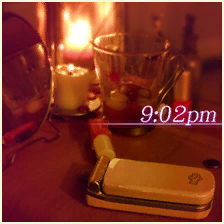</td>
      <td markdown="span">[9:02pm](9-02pm)</td>
      <td>Vol. 17</td>
      <td>Azusa</td>
      <td>VI.</td>
      <td class="da"></td>
      <td class="vi"></td>
      <td class="vo"></td>
      <td></td>
      <td>70</td>
      <td></td>
      <td></td>
      <td>✗</td>
  </tr>
  <tr>
      <td>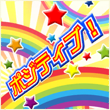</td>
      <td markdown="span">[Positive!](positive)</td>
      <td>Vol. 18</td>
      <td>Ami, Mami</td>
      <td>VI.</td>
      <td class="da"></td>
      <td class="vi"></td>
      <td class="vo"></td>
      <td></td>
      <td>138</td>
      <td></td>
      <td></td>
      <td>✗</td>
    </tr>
  </tbody>
</table>

{: .note }
> Some data for the **DLC Songs** section is still incomplete.  
> The following columns are missing information: **Lyrics**, **Appeal count**, and **Effects**.  
> These will be updated once accurate values are verified.  
>
> If you have reliable sources or data, you’re welcome to **contribute** by submitting updates through the repository.

## Exclusively Used by Rivals

| Thumbnail | Song | Remarks |
|------------|------|---------|
| 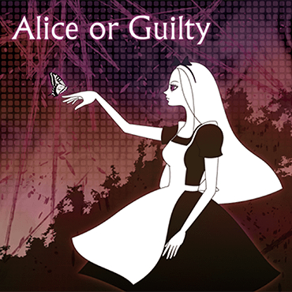 | [Alice or Guilty](alice-or-guilty) | Jupiter exclusive |
|  | [Koi wo Hajimeyou](koi-wo-hajimeyou) | Jupiter exclusive |

## Exclusively Used for Endings

(cannot use in Produce Mode or S4U Mode)

| Thumbnail | Song | Remarks |
|------------|------|---------|
| N/A | [First Step](first-step) |The "true" ending song in Yukiho's storyline |
| N/A | [I ~ and you ~](i-and-you) |Bad ending|

## Special Songs

| Thumbnail | Song | Remarks |
|------------|------|---------|
| 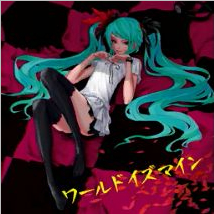 | [World is Mine](world-is-mine) | Hatsune Miku (DLC Song, Miku exclusive) |
|  | [Alive](alive) | Hidaka Ai (DLC Song, Ai exclusive) |
| 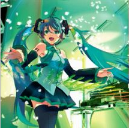 | [Melt](melt) | Hatsune Miku (DLC Song, Miku exclusive) |
| 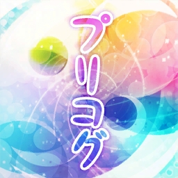 | [Precog](precog) | Mizutani Eri (DLC Song, Eri exclusive) |
|  | [Dazzling World](dazzling-world) | Akizuki Ryō (DLC Song, Ryō exclusive) |
